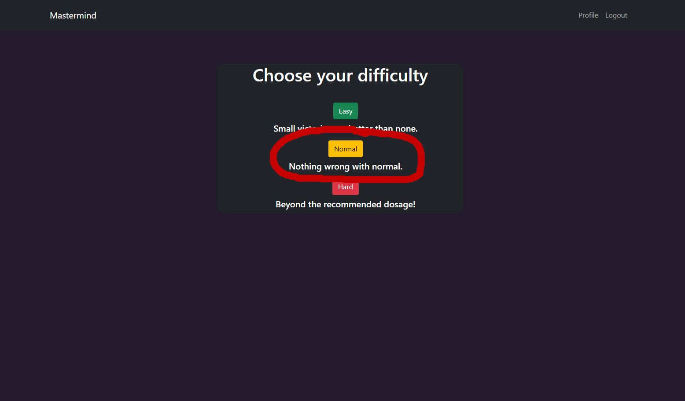

# Mastermind

This is a Mastermind game for LinkedIn's REACH program. 
The main focus for this app is backend-development. This is a full-stack app with uses
Python and Flask for both the front-end and back-end.


## Run Locally

Clone the project

```bash
  git clone https://github.com/TheHamhams/mastermind.git
```

Go to the project directory

```bash
  cd mastermind
```
To install virtualenv
```
  pip install virtualenv
```

Create and activate virtual environment (virtualenv Windows)

```bash
  virtualenv venv
  source venv/Scripts/activate
```
Create and activate virtual environment (virtualenv Linux)

```bash
  virtualenv venv
  source venv/bin/activate
```
Install requirements
```bash
  pip install -r requirements.txt
```
Next create a .env file in current directory. It should contain the following information.
```bash
  FLASK_APP=mastermind
  SQLALCHEMY_DATABASE_URI=sqlite:///site.db
  SECRET_KEY='secret key goes here'
```
Create database
```bash
  flask db init
  flask db migrate
  flask db upgrade
```
Finally, the app can be ran from the terminal.
```bash
  flask run
```
## Getting Started
#### Go To Sign Up Page

#### Create an account

#### Login

#### Click Start

#### Choose a Difficulty

#### Play The Game
